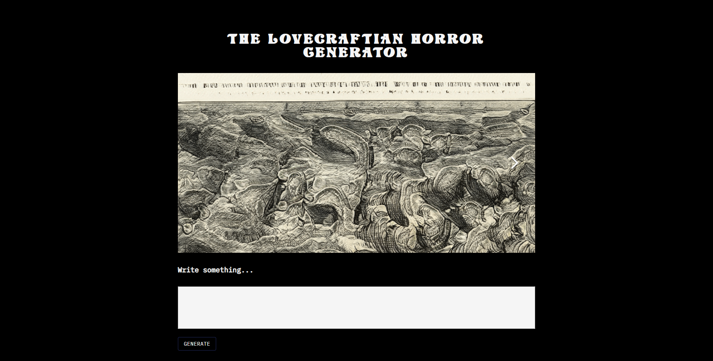

# **Lovecraftian Generator**

### **Developed by:** Juan Carlos Garfias Tovar 

 

## **About**

This is a cosmic horror generator created by Juan Carlos Garfias Tovar as a final project for School of Machines Algorithmic Poetry by professor Mario Guzman (2021)

This project aims to be a complete experience by using music, literature, art and A.I

The project used two main Machine Learning networks, StyleGAN ADA and GPT2. This models were trained for several days in order to learn about the escence of H.P Lovecraft and his horror. 

## **Training**

GPT2 was trained with the 51 345M model by finetuning it with the follwing books:
- At the mointain of madness
- The Fisherman
- Kraken
- The Scar
- Complete Stories and Poems of Edgar Allan Poe
- The Hound
- Tales of the Cthulhu
- Supernatural Horror In Literature
- Floaters
- 20,000 Leagues Under The sea
- A journey into the interior of the Earth
- The collected works of Jules Verne
- Sphere
- Jaws
- In search of the unknown
- Project Gutenberg
- The Mystery of choice
- The Dunwich Horror
- The Hound
- The nameless city
- The complete works of H.P Lovecraft
- The dreams in the witch
- The festival
- The Haunter of the dark
- The shadow of the dark
- The shadow out of time
- The shadow over innsmoth
- The thing on the doorstep
- The whisperer in darkness
- Dead Sea

StyleGan ADA was trained with sea creatures ilustrations from between the 13th and 18th century from books and maps

## **How to run**
Clone this repository and follow all the steps in the readme of each folder

Soon to be released as a website!

